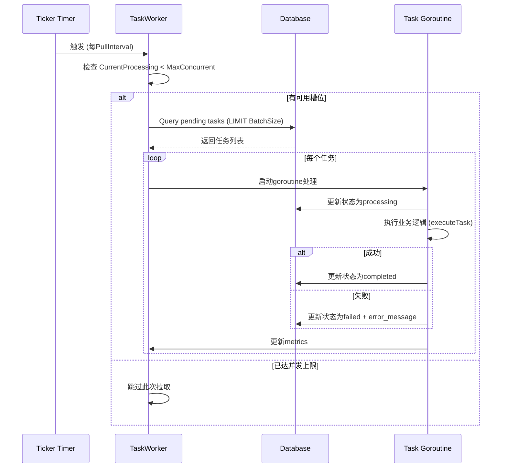

# TaskWorker 使用文档

## 目录

1. [概述](#概述)
2. [快速开始](#快速开始)
3. [配置参数详解](#配置参数详解)
4. [架构设计](#架构设计)
5. [工作流程](#工作流程)
6. [监控指标](#监控指标)
7. [扩展执行逻辑](#扩展执行逻辑)
8. [最佳实践](#最佳实践)
9. [故障排查](#故障排查)
10. [与Outbox/DLQ对比](#与outboxdlq对比)

---

## 概述

### 什么是TaskWorker？

TaskWorker是unified-io服务中用于**拉取和处理任务**的后台Worker组件。它采用简单的轮询模式，定期从数据库查询pending状态的任务并异步处理。

### 核心特性

- ✅ **轮询拉取** - 定期从数据库拉取待处理任务（默认10秒间隔）
- ✅ **批量处理** - 支持每次拉取多个任务（默认10个）
- ✅ **并发控制** - 限制最大并发处理数（默认5个）
- ✅ **超时保护** - 单个任务超时自动取消（默认5分钟）
- ✅ **Stale检测** - 监控长时间未处理的任务（默认1小时）
- ✅ **性能指标** - 实时统计拉取、处理、成功、失败等指标
- ✅ **优雅关闭** - 通过context取消机制安全停止

### 设计理念

**简单实用，避免过度设计**。TaskWorker专注于解决unified-io服务的核心需求：
- 当前unified-io服务不发送Kafka消息
- 无需Outbox Pattern的复杂性
- 10秒轮询频率足够满足业务需求
- 依赖数据库事务保证一致性

---

## 快速开始

### 1. 启用TaskWorker

TaskWorker默认已启用，在`io.yaml`配置中：

```yaml
TaskWorker:
  Enabled: true  # 是否启用
```

### 2. 查看运行状态

启动unified-io RPC服务后，日志中会显示：

```bash
{"level":"info","content":"TaskWorker starting","pull_interval":"10s","batch_size":10,"max_concurrent":5}
{"level":"info","content":"TaskWorker started successfully"}
```

### 3. 监控任务处理

查看任务处理日志：

```bash
{"level":"info","content":"Pulled pending tasks","count":5}
{"level":"info","content":"Processing task started","task_id":1,"task_name":"discovery-task","task_type":"discovery"}
{"level":"info","content":"Task completed successfully","task_id":1,"duration":"150ms"}
```

---

## 配置参数详解

### 配置位置

文件：`/opt/code/newbee/unified-io/rpc/etc/io.yaml`

### 完整配置示例

```yaml
TaskWorker:
  Enabled: true                 # 是否启用TaskWorker
  PullInterval: 10s             # 任务拉取间隔（默认10秒）
  BatchSize: 10                 # 每次拉取任务数量（默认10）
  MaxConcurrent: 5              # 最大并发处理任务数（默认5）
  TaskTimeout: 5m               # 单个任务超时时间（默认5分钟）
  StaleThreshold: 1h            # 任务stale阈值（默认1小时）
  StaleCheckInterval: 5m        # stale任务检查间隔（默认5分钟）
```

### 参数说明

| 参数 | 类型 | 默认值 | 说明 |
|------|------|--------|------|
| `Enabled` | bool | `true` | 是否启用TaskWorker。设为false则不启动Worker |
| `PullInterval` | duration | `10s` | 任务拉取间隔。值越小拉取越频繁，建议5-60秒 |
| `BatchSize` | int | `10` | 每次拉取的最大任务数。建议根据任务处理速度调整 |
| `MaxConcurrent` | int | `5` | 最大并发处理任务数。防止系统过载 |
| `TaskTimeout` | duration | `5m` | 单个任务超时时间。超时则标记为failed |
| `StaleThreshold` | duration | `1h` | Stale任务阈值。创建时间超过此值的pending任务会被告警 |
| `StaleCheckInterval` | duration | `5m` | Stale检查间隔。定期检查是否有stuck的任务 |

### 配置调优建议

**高吞吐量场景**：
```yaml
PullInterval: 5s      # 更频繁拉取
BatchSize: 20         # 更大批量
MaxConcurrent: 10     # 更高并发
```

**资源受限场景**：
```yaml
PullInterval: 30s     # 降低拉取频率
BatchSize: 5          # 减小批量
MaxConcurrent: 3      # 降低并发
```

**关键任务场景**：
```yaml
TaskTimeout: 10m      # 更长超时时间
StaleThreshold: 30m   # 更早stale告警
StaleCheckInterval: 2m # 更频繁检查
```

---

## 架构设计

### 整体架构

```
┌─────────────────────────────────────────────────────────────┐
│                      ServiceContext                         │
│  ┌────────────────────────────────────────────────────┐    │
│  │                   TaskWorker                        │    │
│  │  ┌──────────────┐          ┌──────────────┐        │    │
│  │  │  pullLoop    │          │ staleCheckLoop│       │    │
│  │  │  (goroutine) │          │  (goroutine)  │       │    │
│  │  └──────┬───────┘          └───────────────┘       │    │
│  │         │                                           │    │
│  │         ▼                                           │    │
│  │  ┌──────────────┐                                  │    │
│  │  │ processOnce()│  ────────►  Query Pending Tasks  │    │
│  │  └──────┬───────┘                                  │    │
│  │         │                                           │    │
│  │         ▼                                           │    │
│  │  ┌──────────────────────────────────┐             │    │
│  │  │ 分发任务到goroutine处理            │             │    │
│  │  │ (限制MaxConcurrent)               │             │    │
│  │  └──────┬───────────────────────────┘             │    │
│  │         │                                           │    │
│  │         ▼                                           │    │
│  │  ┌──────────────────┐  ┌──────────────────┐       │    │
│  │  │ processTask()    │  │ processTask()    │ ...   │    │
│  │  │ (goroutine 1)    │  │ (goroutine 2)    │       │    │
│  │  └──────────────────┘  └──────────────────┘       │    │
│  └────────────────────────────────────────────────────┘    │
└─────────────────────────────────────────────────────────────┘
```

### 核心组件

#### 1. TaskWorker结构体

```go
type TaskWorker struct {
    db        *ent.Client              // 数据库客户端
    config    *WorkerConfig            // Worker配置
    metrics   *TaskWorkerMetrics       // 性能指标
    running   bool                     // 运行状态
    mu        sync.RWMutex             // 状态锁
    cancelCtx context.CancelFunc       // 取消函数
}
```

#### 2. pullLoop（任务拉取循环）

- 使用`time.Ticker`定期触发
- 调用`processOnce()`执行任务拉取和分发
- 通过`ctx.Done()`优雅停止

#### 3. processOnce（单次拉取处理）

1. 检查当前并发数是否达到`MaxConcurrent`
2. 计算可拉取的任务数（`MaxConcurrent - CurrentProcessing`）
3. 查询数据库获取pending任务
4. 分发到goroutine异步处理

#### 4. processTask（任务处理）

1. 创建带超时的context
2. 更新任务状态为`processing`
3. 调用`executeTask()`执行业务逻辑
4. 根据结果更新任务状态为`completed`或`failed`

#### 5. staleCheckLoop（Stale检查循环）

- 定期查询创建时间超过`StaleThreshold`的pending任务
- 记录告警日志
- 可集成到监控系统

---

## 工作流程

### 完整流程图



### 状态转换

```
pending ──────► processing ──────► completed
                    │
                    └──────────────► failed (超时或异常)
```

### 并发控制机制

```go
// 拉取前检查
if currentProcessing >= MaxConcurrent {
    return // 跳过本次拉取
}

// 计算可拉取数量
availableSlots := MaxConcurrent - currentProcessing
pullSize := min(BatchSize, availableSlots)

// 拉取任务
tasks := db.Query().Limit(pullSize).All()

// 分发处理
for _, task := range tasks {
    incrementProcessing()  // 原子递增
    go processTask(task)   // 异步处理
}
```

---

## 监控指标

### 可用指标

通过`worker.GetMetrics()`获取实时指标：

```go
type TaskWorkerMetrics struct {
    TotalPulled      int64     // 总拉取任务数
    TotalProcessed   int64     // 总处理任务数
    TotalSucceeded   int64     // 总成功任务数
    TotalFailed      int64     // 总失败任务数
    CurrentProcessing int64     // 当前正在处理的任务数
    LastPullTime     time.Time // 上次拉取时间
    LastCheckTime    time.Time // 上次检查stale任务时间
}
```

### 监控示例

```go
// 在logic中获取TaskWorker实例
worker := l.svcCtx.TaskWorker

if worker != nil {
    metrics := worker.GetMetrics()

    logx.Infow("TaskWorker metrics",
        logx.Field("total_pulled", metrics.TotalPulled),
        logx.Field("total_processed", metrics.TotalProcessed),
        logx.Field("success_rate", float64(metrics.TotalSucceeded)/float64(metrics.TotalProcessed)),
        logx.Field("current_processing", metrics.CurrentProcessing))
}
```

### 关键指标分析

| 指标 | 正常范围 | 异常情况 | 处理建议 |
|------|----------|----------|----------|
| `CurrentProcessing` | 0 - MaxConcurrent | 持续等于MaxConcurrent | 增加MaxConcurrent或PullInterval |
| `TotalFailed` | < 5% | > 10% | 检查任务处理逻辑或增加TaskTimeout |
| `LastPullTime` | 近期时间 | 超过2*PullInterval | 检查Worker是否正常运行 |
| `TotalPulled - TotalProcessed` | 0 | > BatchSize*2 | 可能有任务卡住，检查日志 |

---

## 扩展执行逻辑

### 当前实现

```go
// executeTask 执行任务的实际业务逻辑
func (w *TaskWorker) executeTask(ctx context.Context, task *ent.InputTask) error {
    logx.Infow("Executing task business logic",
        logx.Field("task_id", task.ID),
        logx.Field("task_type", task.TaskType))

    // 模拟任务处理
    select {
    case <-time.After(100 * time.Millisecond):
        return nil // 任务处理成功
    case <-ctx.Done():
        return ctx.Err() // 任务超时或取消
    }
}
```

### 扩展方法1：根据task_type分发

推荐实现：

```go
func (w *TaskWorker) executeTask(ctx context.Context, task *ent.InputTask) error {
    switch task.TaskType {
    case "discovery":
        return w.handleDiscoveryTask(ctx, task)
    case "transform":
        return w.handleTransformTask(ctx, task)
    case "validation":
        return w.handleValidationTask(ctx, task)
    default:
        return fmt.Errorf("unknown task type: %s", task.TaskType)
    }
}

func (w *TaskWorker) handleDiscoveryTask(ctx context.Context, task *ent.InputTask) error {
    // 实现discovery任务逻辑
    // 1. 调用discovery provider
    // 2. 转换数据格式
    // 3. 写入output_tasks表
    return nil
}
```

### 扩展方法2：注册Handler模式

更灵活的实现：

```go
type TaskHandler interface {
    Handle(ctx context.Context, task *ent.InputTask) error
}

type TaskWorker struct {
    // ...
    handlers map[string]TaskHandler
}

func (w *TaskWorker) RegisterHandler(taskType string, handler TaskHandler) {
    w.handlers[taskType] = handler
}

func (w *TaskWorker) executeTask(ctx context.Context, task *ent.InputTask) error {
    handler, ok := w.handlers[task.TaskType]
    if !ok {
        return fmt.Errorf("no handler registered for task type: %s", task.TaskType)
    }
    return handler.Handle(ctx, task)
}
```

在`service_context.go`中注册：

```go
taskWorker.RegisterHandler("discovery", &DiscoveryHandler{svcCtx: svcCtx})
taskWorker.RegisterHandler("transform", &TransformHandler{svcCtx: svcCtx})
```

---

## 最佳实践

### 1. 配置调优

**根据任务特性调整**：

- **IO密集型任务**（如API调用、文件读取）
  - 增加`MaxConcurrent`（如10-20）
  - 减少`PullInterval`（如5s）

- **CPU密集型任务**（如数据转换、计算）
  - 限制`MaxConcurrent`为CPU核心数
  - 适当增加`PullInterval`

- **长时间运行任务**
  - 增加`TaskTimeout`（如15m-30m）
  - 减少`MaxConcurrent`避免资源耗尽

### 2. 错误处理

**在executeTask中实现重试逻辑**：

```go
func (w *TaskWorker) executeTaskWithRetry(ctx context.Context, task *ent.InputTask) error {
    maxRetries := 3
    for attempt := 1; attempt <= maxRetries; attempt++ {
        err := w.executeTask(ctx, task)
        if err == nil {
            return nil
        }

        // 最后一次失败则返回错误
        if attempt == maxRetries {
            return fmt.Errorf("failed after %d attempts: %w", maxRetries, err)
        }

        // 指数退避
        backoff := time.Duration(attempt) * time.Second
        select {
        case <-time.After(backoff):
            continue
        case <-ctx.Done():
            return ctx.Err()
        }
    }
    return nil
}
```

### 3. 任务优先级

**实现优先级队列**（修改processOnce）：

```go
tasks, err := w.db.InputTask.Query().
    Where(inputtask.TaskStatusEQ("pending")).
    Order(
        ent.Desc(inputtask.FieldPriority), // 高优先级优先
        ent.Asc(inputtask.FieldCreatedAt),  // 同优先级先进先出
    ).
    Limit(pullSize).
    All(ctx)
```

### 4. 监控集成

**集成Prometheus**：

```go
var (
    tasksPulled = prometheus.NewCounterVec(
        prometheus.CounterOpts{
            Name: "task_worker_tasks_pulled_total",
            Help: "Total number of tasks pulled",
        },
        []string{"task_type"},
    )

    tasksProcessed = prometheus.NewCounterVec(
        prometheus.CounterOpts{
            Name: "task_worker_tasks_processed_total",
            Help: "Total number of tasks processed",
        },
        []string{"task_type", "status"},
    )
)

func (w *TaskWorker) handleTaskSuccess(ctx context.Context, task *ent.InputTask, duration time.Duration) {
    // 更新数据库
    // ...

    // 更新Prometheus指标
    tasksProcessed.WithLabelValues(task.TaskType, "success").Inc()
}
```

### 5. 日志最佳实践

**结构化日志**：

```go
logx.Infow("Task processing started",
    logx.Field("task_id", task.ID),
    logx.Field("task_name", task.TaskName),
    logx.Field("task_type", task.TaskType),
    logx.Field("tenant_id", task.TenantID),
    logx.Field("attempt", task.RetryCount))

logx.Infow("Task processing completed",
    logx.Field("task_id", task.ID),
    logx.Field("duration_ms", duration.Milliseconds()),
    logx.Field("status", "success"))
```

---

## 故障排查

### 问题1：任务一直pending，未被处理

**可能原因**：
1. TaskWorker未启动
2. Worker已达MaxConcurrent上限
3. 查询条件不匹配

**排查步骤**：

```bash
# 1. 检查Worker是否启动
grep "TaskWorker starting" /path/to/logs/io.log

# 2. 检查当前并发数
# 在logic中添加日志：
metrics := svcCtx.TaskWorker.GetMetrics()
logx.Infow("CurrentProcessing", logx.Field("count", metrics.CurrentProcessing))

# 3. 检查数据库中pending任务
mysql> SELECT COUNT(*) FROM io_input_tasks WHERE task_status='pending';
```

**解决方案**：
- 确认`TaskWorker.Enabled = true`
- 增加`MaxConcurrent`
- 减少`PullInterval`

---

### 问题2：任务频繁失败

**可能原因**：
1. TaskTimeout设置过短
2. 业务逻辑有bug
3. 外部依赖不可用

**排查步骤**：

```bash
# 1. 查看失败任务的错误信息
mysql> SELECT id, task_name, error_message, updated_at
       FROM io_input_tasks
       WHERE task_status='failed'
       ORDER BY updated_at DESC
       LIMIT 10;

# 2. 查看Worker指标
metrics := worker.GetMetrics()
failureRate := float64(metrics.TotalFailed) / float64(metrics.TotalProcessed)
```

**解决方案**：
- 增加`TaskTimeout`
- 在executeTask中添加详细日志
- 实现重试逻辑
- 添加熔断器保护外部依赖

---

### 问题3：Stale任务告警

**可能原因**：
1. 任务创建后长时间未被拉取
2. Worker停止运行
3. 所有Worker都在处理其他任务

**排查步骤**：

```bash
# 1. 查看stale任务
mysql> SELECT id, task_name, created_at, TIMESTAMPDIFF(HOUR, created_at, NOW()) as hours_old
       FROM io_input_tasks
       WHERE task_status='pending'
       AND created_at < NOW() - INTERVAL 1 HOUR;

# 2. 检查Worker运行状态
isRunning := worker.IsRunning()
```

**解决方案**：
- 增加Worker实例
- 减少`PullInterval`
- 增加`MaxConcurrent`
- 检查是否有卡死的任务占用槽位

---

### 问题4：内存或CPU占用过高

**可能原因**：
1. MaxConcurrent设置过大
2. 任务处理逻辑有内存泄漏
3. 数据库查询返回大量数据

**排查步骤**：

```bash
# 1. 查看进程资源占用
top -p $(pgrep io-rpc)

# 2. Go pprof分析
curl http://localhost:4005/debug/pprof/heap > heap.prof
go tool pprof heap.prof
```

**解决方案**：
- 降低`MaxConcurrent`
- 使用pprof定位内存泄漏
- 在executeTask中及时释放资源
- 限制单次查询数据量

---

## 与Outbox/DLQ对比

### 为什么不使用Outbox Pattern？

| 对比项 | TaskWorker (当前方案) | Outbox Pattern |
|--------|---------------------|----------------|
| **适用场景** | 无Kafka消息发送需求 | 需要可靠发送Kafka消息 |
| **复杂度** | 低（400行代码） | 高（2000+行代码） |
| **延迟** | 10秒（可配置） | 毫秒级 |
| **一致性保证** | 数据库事务 | 数据库事务 + 消息发送 |
| **依赖组件** | 仅数据库 | 数据库 + Kafka + Relay服务 |
| **运维成本** | 低 | 高 |

### 何时应该切换到Outbox？

**切换条件**（满足任一即可）：

1. ✅ **需要发送Kafka消息**
   - 任务处理结果需要通知其他服务
   - 需要事件驱动架构

2. ✅ **延迟要求 < 1秒**
   - 当前10秒轮询无法满足
   - 需要实时性保证

3. ✅ **任务量 > 10000/小时**
   - 当前轮询模式可能导致数据库压力
   - 需要更高吞吐量

4. ✅ **需要At-Least-Once语义**
   - 任务不能丢失
   - 允许重复处理

### 当前方案的优势

1. **简单实用** - 10秒延迟足够满足当前业务需求
2. **易于理解** - 新人快速上手，无需学习Kafka
3. **低运维成本** - 无需维护额外的Kafka集群和Relay服务
4. **调试友好** - 数据库中可直接查看任务状态
5. **事务保证** - 依赖数据库事务，无需处理分布式事务

### 迁移路径（如未来需要）

如果未来业务发展需要切换到Outbox Pattern：

1. **保持数据模型不变** - `io_input_tasks`表可复用
2. **增加Outbox表** - 新增`io_outbox_events`表
3. **实现Relay服务** - 读取Outbox并发送Kafka
4. **灰度切换** - TaskWorker和Outbox并行运行一段时间
5. **逐步迁移** - 按task_type逐步切换到Outbox

---

## 总结

TaskWorker是一个**简单、实用、可靠**的任务处理方案，特别适合：

- ✅ 不需要Kafka消息发送
- ✅ 可接受10秒级延迟
- ✅ 任务量适中（< 10000/小时）
- ✅ 团队规模较小，追求简单可维护

如有问题或建议，请联系开发团队。

---

**文档版本**: v1.0
**最后更新**: 2025-10-24
**维护者**: Unified-IO团队
